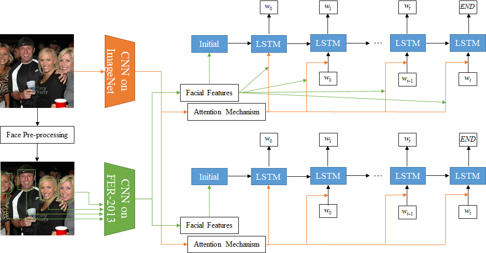

# FlickrFace11K

This project contains the FlickrFace11K data, extracted from [Flickr30K](http://shannon.cs.illinois.edu/DenotationGraph/) image caption dataset, splits for training, validation and testing. The splits are NumPy array files including the name of images in the dataset and their corresponding facial expression labels. Using the label files, you can train a new image captioning model without training a facial expression recognition module. Each label consists of seven binary digits defining 'angry', 'disgust', 'fearful', 'happy', 'sad', 'surprised', and 'neutral', respectively. For example, [0. 0. 0. 1. 0. 0. 0.] is the label of 'happy' samples. 

FlickrFace11K dataset has been used in our work [Face-Cap: Image Captioning using Facial Expression Analysis](https://arxiv.org/abs/1808.02324):

Image captioning is the process of generating a natural language description of an image. Most current image captioning models, however, do not take into account the emotional aspect of an image, which is very relevant to activities and interpersonal relationships represented therein. Towards developing a model that can produce human-like captions incorporating these, we use facial expression features extracted from images including human faces, with the aim of improving the descriptive ability of the model. In this work, we present two variants of our Face-Cap model, which embed facial expression features in different ways, to generate image captions. 

<p align="center">

</p>

### Reference
if you use our data or model, please cite our paper:
```
@article{nezami2018face,
  title={Face-Cap: Image Captioning using Facial Expression Analysis},
  author={Nezami, Omid Mohamad and Dras, Mark and Anderson, Peter and Hamey, Len},
  journal={arXiv preprint arXiv:1807.02250},
  year={2018}
}
```   
